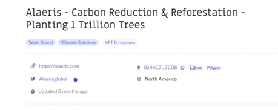

# 🏧 Copy of How to Convert Individual Donations to Fiat

Written steps for converting individual donations into fiat are listed below, but if you prefer to be walked through the process you can watch this video:&#x20;



1.  Visit your grant’s page. By the ETH icon, identify the wallet address associated with your grant. This is where the individual donations were sent.\

    <figure><figcaption></figcaption></figure>
2.  Before you can convert your donations, you need to know what you have! View how many individual donations you received in different currencies. You will see these by clicking in 3 places: your address(etherscan), the “zkSync” button, and the “Polygon” button. You may not have funds for all 3. Below there are instructions for how to convert each type to fiat.\

    <figure><figcaption></figcaption></figure>
3. Before you begin converting: check first which tokens are available and what exchanges you have access to locally before making these transactions. In the past, grantees have been known to send thousands of dollars in DAI to an exchange that didn't list DAI and the funds were lost.
4. **To convert polygon**: We recommend using [Uniswap](https://uniswap.org) to convert everything to the same token if they aren’t already. Then you will connect your wallet, turn on Polygon, and make the transactions. [Here is a guide](https://www.coindesk.com/learn/how-to-connect-metamask-to-the-polygon-network/) for connecting Metamask to the Polygon network.
5. **To convert zkSync**: You can convert directly from zkSync. When you log in, you will see a swap function. You will need to use a bridge and a service to convert, like [Coinbase](https://www.coinbase.com/home). For more detailed information on withdrawing funds to zksync, check out this [article](https://support.gitcoin.co/gitcoin-grants/grantee-questions/how-can-i-withdraw-my-funds-from-zksync).

***
