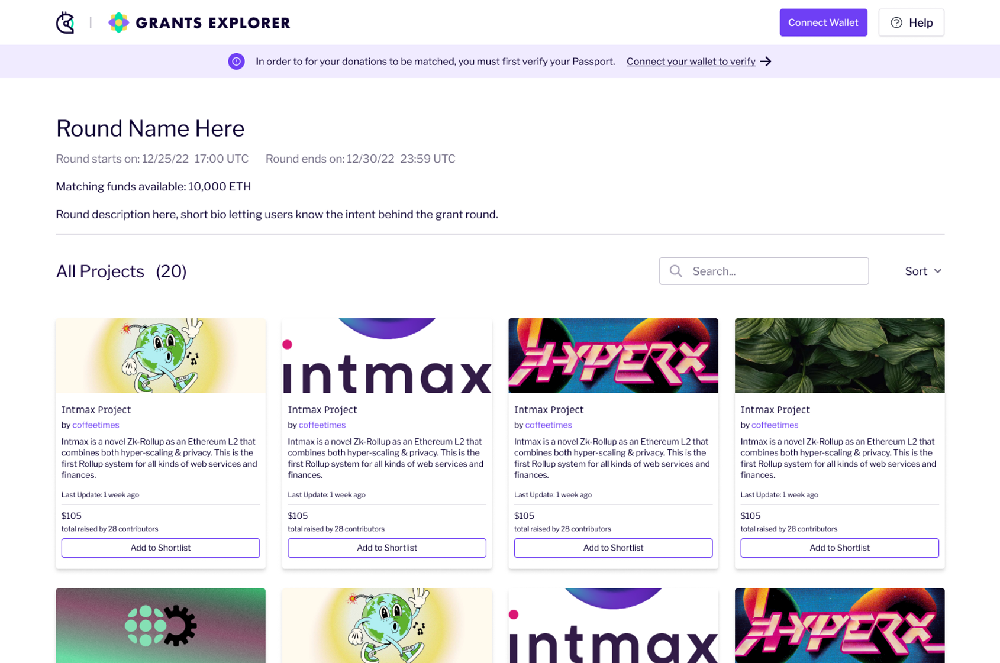

# Grants Explorer Guide

## TL;DR

_Grants Explorer allows donors to browse through and donate to projects that have been approved in any single round._

### Pre-Round Screen

The Grants Explorer landing page UI changes based on whether a round has started or not. If a round has not begun yet, the landing page could look something like this:

<figure><figcaption></figcaption></figure>

This page allows you to get information on:

* What the round name is and a short description
* When the application period is
* When the round period is
* How much matching funds are available
* Round eligibility requirements with a button that lets you apply to the round on Grants Hub if you choose to do so

### Active Round Screen

The UI of the landing page will change once the round becomes active. That is, once Round Operators have approved projects for their round and the round has begun. The landing page would then look something like this:

<figure><figcaption></figcaption></figure>

You will be able to:

* Browse through projects
* Search and sort through projects
* Add projects to their Shortlist
* Click on projects to learn more about them

### Project Details page

As you browse the landing page, you might want to click on a project to learn more about it. You will be led to a page that looks like this:

<figure><figcaption></figcaption></figure>

Here, you will be able to:

* Learn more about a project
* Browse through their website, social media, GitHub, etc.
* See how much funding they’ve received thus far
* See how many contributors have contributed thus far
* See how many days are left in the round
* Add their project to the Shortlist

### The Shortlist

As you browse projects on GE, you are able to add projects you like to a non-finalized list that we call the Shortlist. After you are done browsing projects, you move to the donation part of the process. Visit _"Using the shortlist function to donate"_ for a step-by-step guide.&#x20;
