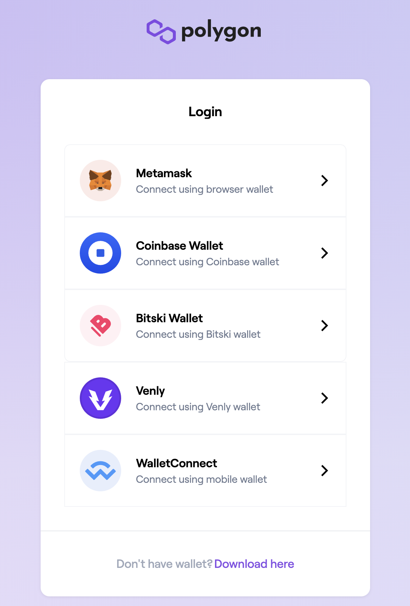
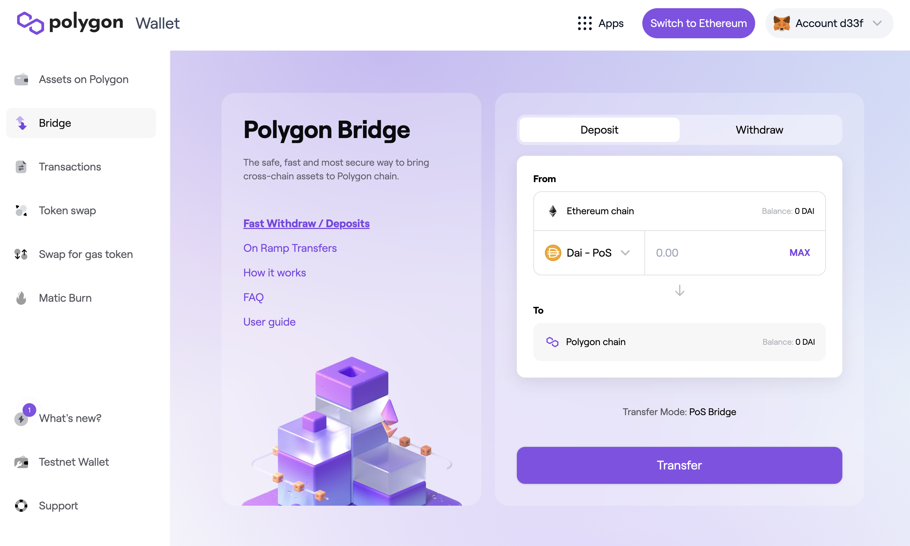
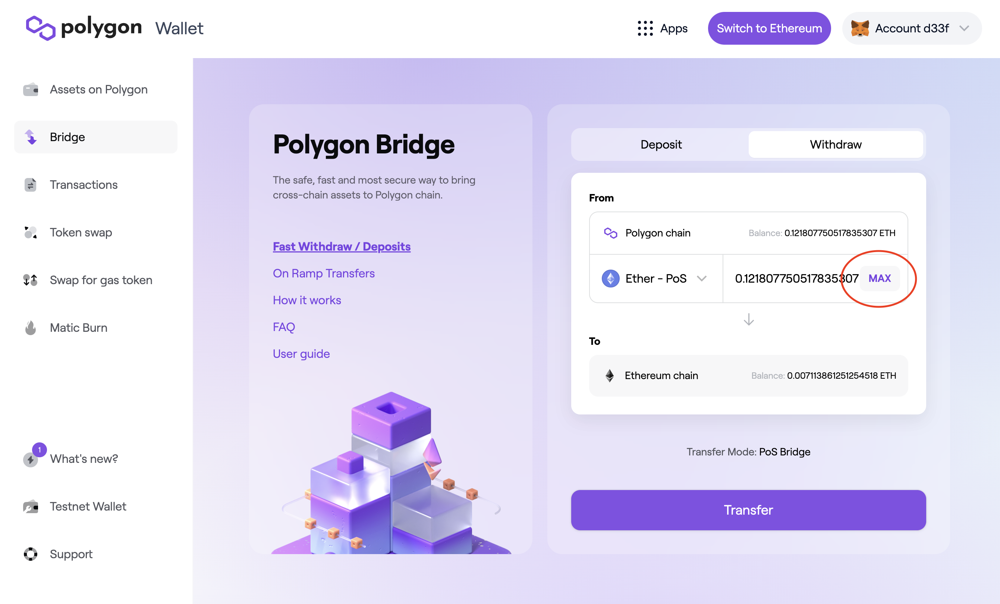
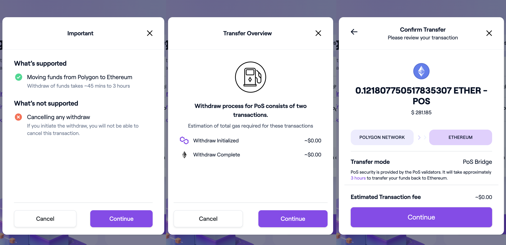
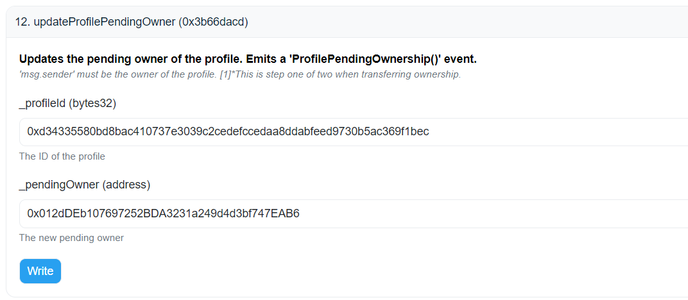

# 🏧 How can I withdraw my funds from Polygon?

Please note that you'll need ETH on Ethereum Mainnet to withdraw from the Polygon network. The withdrawal process will usually **take around 4 hours to complete**.&#x20;

### How to withdraw from Polygon to Ethereum

1. Go to [https://wallet.polygon.technology/bridge/](https://web.archive.org/web/20211205144715/https://wallet.polygon.technology/bridge/) and connect your MetaMask wallet with the same admin address provided during the creation of your grant.

2\. After connecting MetaMask, you will see the Polygon Bridge dashboard.

3\. By default, the 'Deposit' view will be shown. Press the 'Withdraw' button (highlighted below in red) to switch to the withdrawals view.

4\. Press the token pair (Dai - PoS is the default) and select ETH (Ether - PoS).

5\. Enter the amount you want to withdraw or simply click "MAX" if you desire to withdraw all your ETH from Polygon.

6\. Click on "Transfer" to proceed. You would be required to click "Continue" on the three-step pop-up modal to confirm you wish to begin the transaction.

7\. Select 'Confirm' on the transaction modal in Metamask. After signing the first transaction, you must **wait approximately 45 mins**. This step will move your L2 funds to a checkpoint on the Ethereum network.

8\. You'll be prompted again to sign another transaction on MetaMask to confirm the transfer of funds from the checkpoint to your MetaMask wallet. This is the second part of the withdrawal process and **may take up to 3 hours to complete**

9\. Confirm your withdrawal was successful [using Etherscan](https://etherscan.io).
