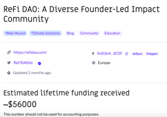

# 💰 Where Are Grant Funds Stored?

Approximately 3 weeks after the Grant Rounds have concluded, you will be able to claim your donations. Before you do, it is important to understand how Gitcoin grant funding is stored.

There are two types of funding:

* **Individual donations**&#x20;
  * No claiming is required as these funds automatically go directly to your wallet at the time of donation. These funds will not show up in your claim history as they were never held by Gitcoin&#x20;
* **Matching funds**&#x20;
  * These are the donations that you received from the matching round that you participate in. The amount is determined by the [Quadratic Funding](https://wtfisqf.com/?grant=\&grant=\&grant=\&grant=\&match=1000) mechanism and must be claimed by the grantee after the round has been completed

There is a notable exception for grants that received matching funds in the Celo or Radicle ecosystem rounds. The total portion of the matching funds will be sent directly to your wallet or through Radicle drips. No claiming is required.

Some Round Owners prefer to payout matching funds with their own token and you will have to claim each unique token match with a separate on-chain transaction. Unless specifically instructed, other rounds are matched in DAI and are claimed together.

**Other notes:**

* Because funding is in cryptocurrency, both individual and matching pool funds can fluctuate from the time of donation.
* Only individual contributions are visible in the “lifetime funding” section of your grants page, therefore total matching funds are not reflected.

<figure><figcaption></figcaption></figure>
