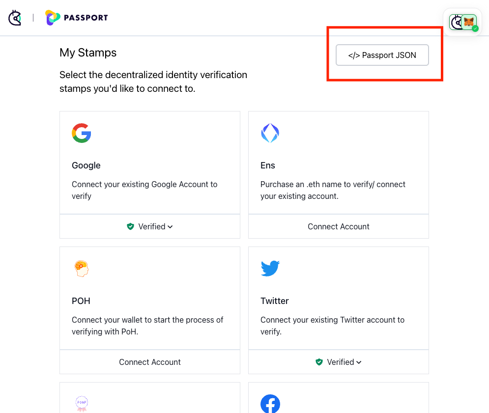
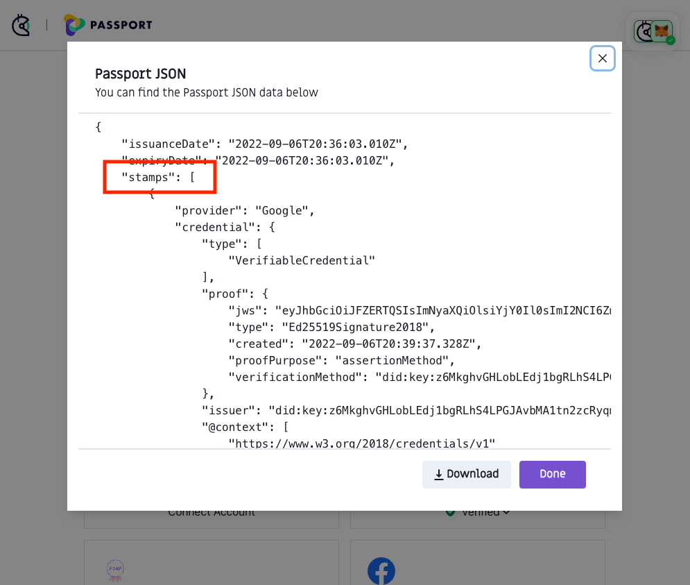
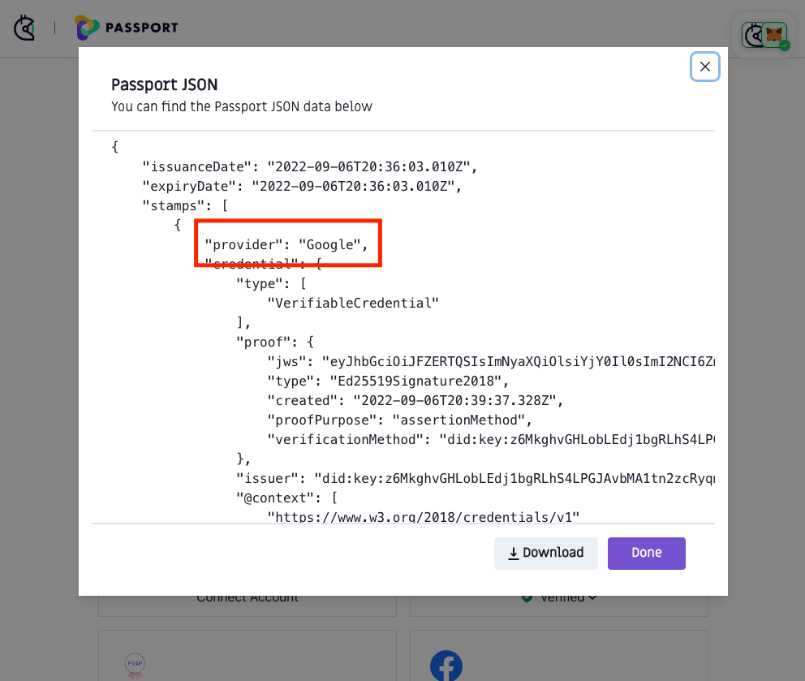
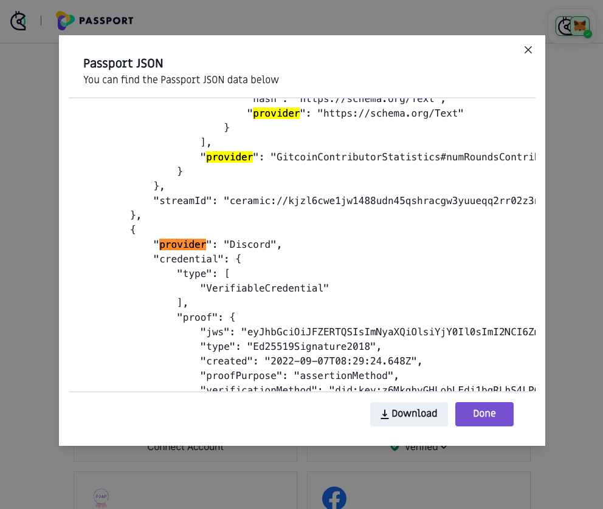

# 💻 How to access your Passport JSON

Passport JSON is the data source storing all of the Stamps on your Gitcoin Passport. JSON (JavaScript Object Notation) is a lightweight way to store and transfer data around the internet. Reading the Passport JSON might be useful to confirm your Passport contains the Stamps that you expect. You don't need to understand programming to use the Passport JSON, though some familiarity might help.

### Accessing your Passport JSON

Step 1: [Go to passport.gitcoin.co](https://passport.gitcoin.co/) and connect your wallet.

Step 2: Click the button containing the text **Passport JSON**.

<figure><figcaption></figcaption></figure>

Step 3: Inspect the data. At the top of the data, you'll see "stamps". Stamps are contained in an array (an ordered list of all of your stamps) on the Passport JSON.

<figure><figcaption></figcaption></figure>

Step 4: Look at the code two lines below "stamps". If you have at least one stamp, you should see a line that says "provider" next to the name of your first stamp. All stamps you've collected will have a provider.

<figure><figcaption></figcaption></figure>

Step 5: Using your browser's search functionality (Ctrl + F on Windows or Cmd + F on Mac) search for "provider". Using this search, you can cycle through all of the stamps you have collected.

<figure><figcaption></figcaption></figure>

### Learn more about JSON

* [JSON for Beginners – JavaScript Object Notation Explained in Plain English](https://www.freecodecamp.org/news/what-is-json-a-json-file-example/) - _Freecodecamp_

### Related topics


[how-do-i-add-passport-stamps](../how-do-i-add-passport-stamps/)


