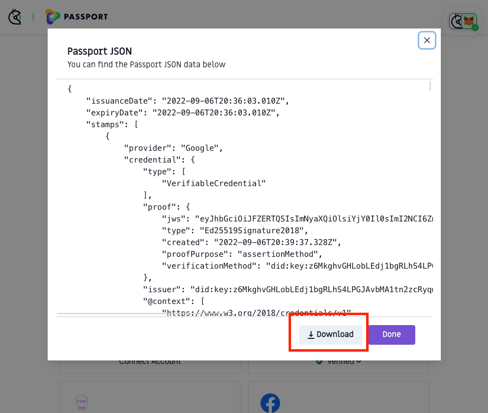
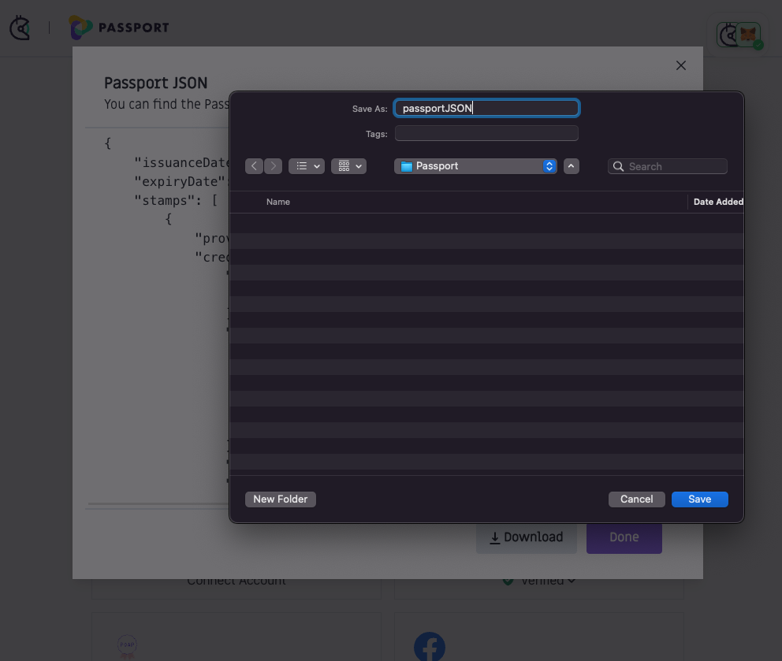

# 💻 How to download your Passport JSON

### Downloading your Passport JSON

Step 1: [Go to passport.gitcoin.co](https://passport.gitcoin.co/) and connect your wallet.

Step 2: Click the button containing the text **Passport JSON**.

<figure><figcaption></figcaption></figure>

Step 3: A pop-up modal should appear. Click the **Download** button.

<figure><figcaption></figcaption></figure>

Step 4: Your operating system will prompt you, asking where you'd like to save the file. Select a suitable location and **click the Save button**.

<figure><figcaption></figcaption></figure>

### Still not working?

If you're unable to download the Passport JSON, you can reach out to our support team via live chat on our website or email at [support@gitcoin.co](mailto:support@gitcoin.co), and we'll try to help resolve your issue.

### Related topics


[how-do-i-add-passport-stamps](../how-do-i-add-passport-stamps/)


