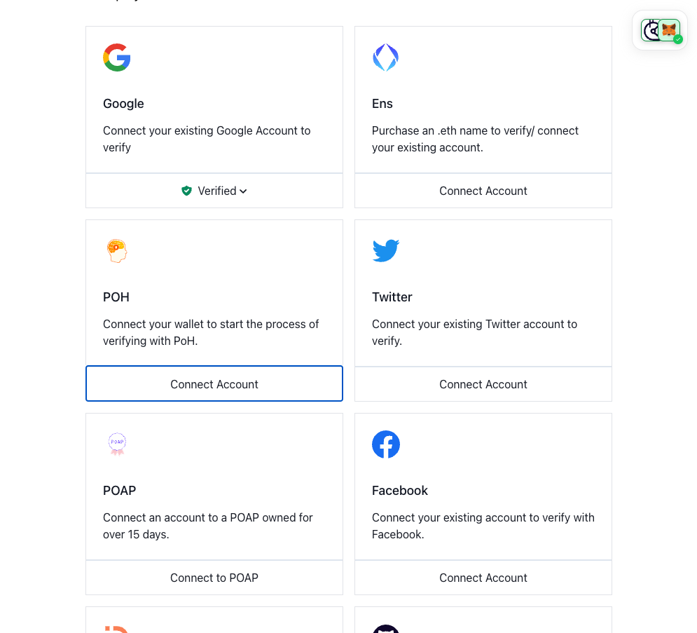
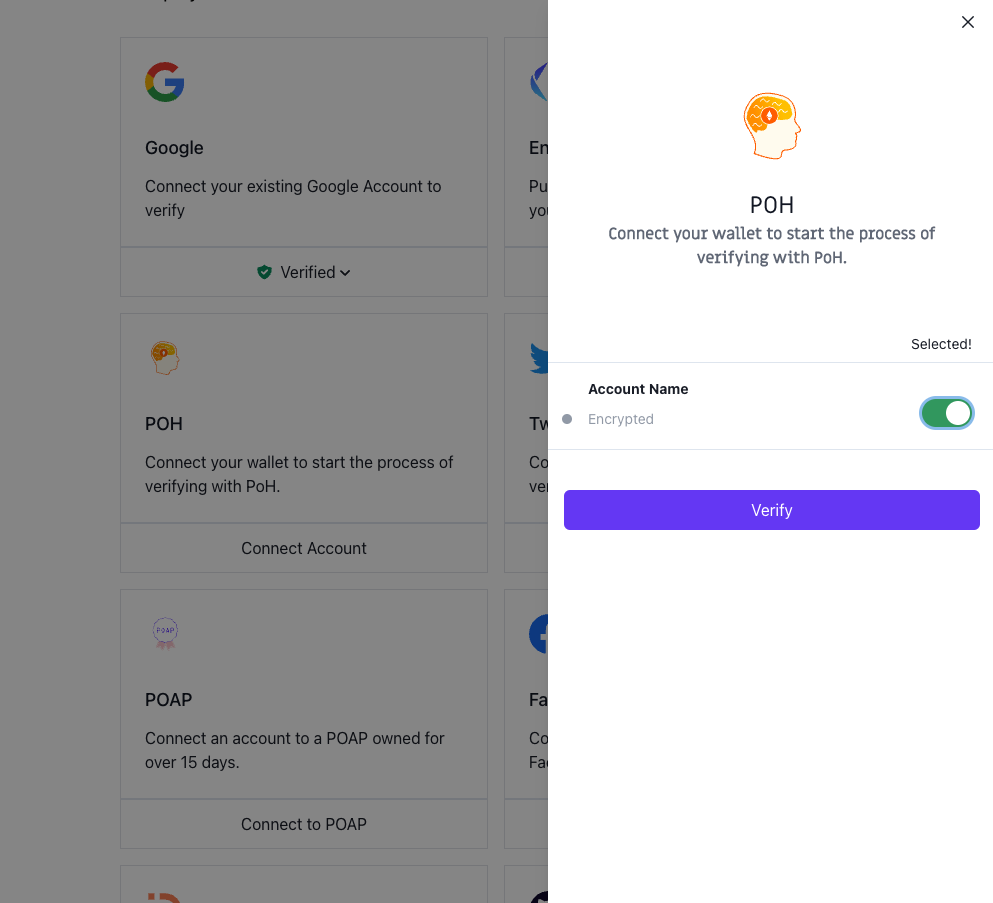
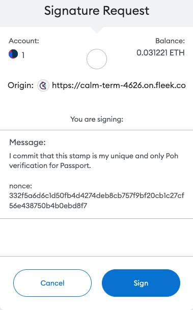
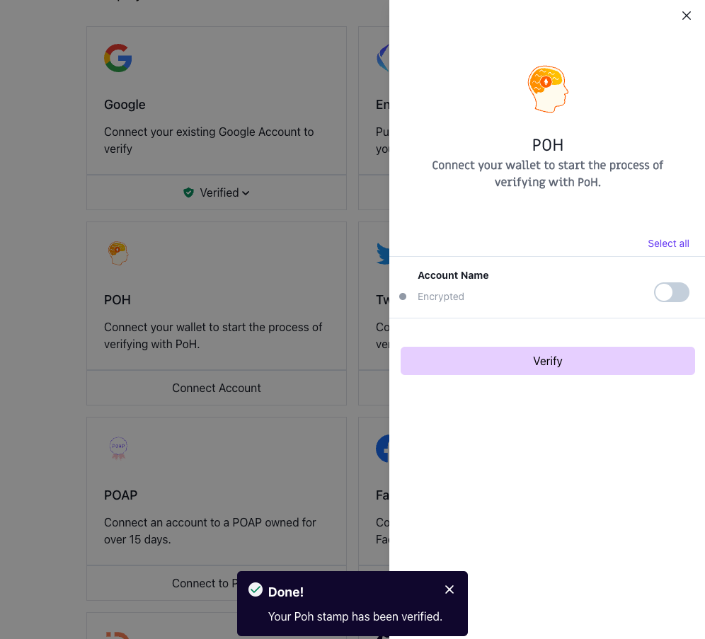

# 🔌 Connecting a Proof of Humanity (PoH) account to Passport

This guide gives instructions on connecting a PoH account to Gitcoin Passport and outlines any known issues.

### Prerequisites

* Gitcoin Passport
  * If you don't already have a Passport setup, you can follow our guide to do that first.
* A PoH account associated with the wallet address registered on your Gitcoin Passport
  * If you do not have a PoH account, you can [create one on the PoH platform](https://www.proofofhumanity.id/).

### How to verify your PoH account

Step 1: [Go to passport.gitcoin.co](https://passport.gitcoin.co/) and connect your wallet.

Step 2: Click **Connect Account** on the POH stamp card.

<figure><figcaption></figcaption></figure>

Step 3: Select the toggles you want to use for your stamp then click **Verify.**

<figure><figcaption></figcaption></figure>

Step 4: A signature request modal will pop up. Read it carefully and then click **Sign**.

<figure><figcaption></figcaption></figure>

Step 5: Return to the passport browser window and confirm your account is now verified.

<figure><figcaption></figcaption></figure>

You can confirm this by seeing the button that previously read as Connect Account will now say **Verified**. Alternatively, [you can inspect the Passport JSON.](../common-questions/how-to-access-your-passport-json.md)

### Still not working?

If you're unable to connect after following these steps, you can talk to the support team through the chat window (bottom right) on this page and many of our product pages, and we'll try to help resolve your issue.
