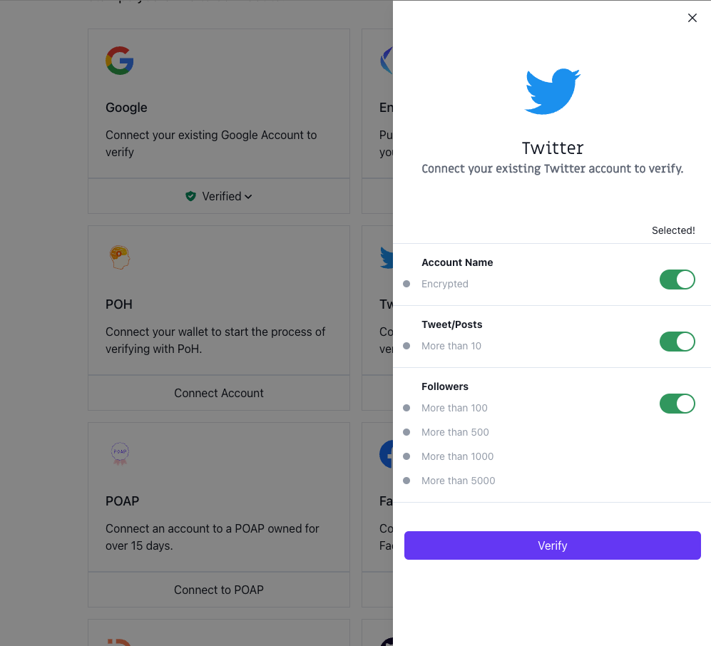

# 🔌 Connecting a Twitter account to Passport

This guide gives instructions on connecting a Twitter account to Gitcoin Passport and outlines any known issues.

### Prerequisites

* Gitcoin Passport
  * If you don't already have a Passport setup, you can follow our guide to do that first.
* A Twitter account
  * If you do not have a Twitter account, you can [create one at twitter.com](https://twitter.com/).

### How to verify your Twitter account

Step 1: [Go to passport.gitcoin.co](https://passport.gitcoin.co/) and connect your wallet.

Step 2: Click **Connect Account** on the Twitter stamp card.

<figure><figcaption></figcaption></figure>

Step 3: Select the toggles you want to use for your stamp then click **Verify.**

<figure><figcaption></figcaption></figure>

Step 4: Click **Authorize app** to allow Gitcoin Passport to calculate your score.

<figure><figcaption></figcaption></figure>

Step 5: A signature request modal will pop up. Read it carefully and then click **Sign**.

<figure><figcaption></figcaption></figure>

Step 6: Return to the passport browser window and confirm your account is now verified.

You can confirm this by seeing the button that previously read as Connect Account will now say **Verified**. Alternatively, [you can inspect the Passport JSON.](../commonly-asked-passport-questions/how-to-access-your-passport-json.md)

### Still not working?

If you're unable to connect after following these steps, you can [message Gitcoin support on Gitcoin's Discord](https://discord.gg/b5PEjyVFXT), and we'll try to help resolve your issue.
