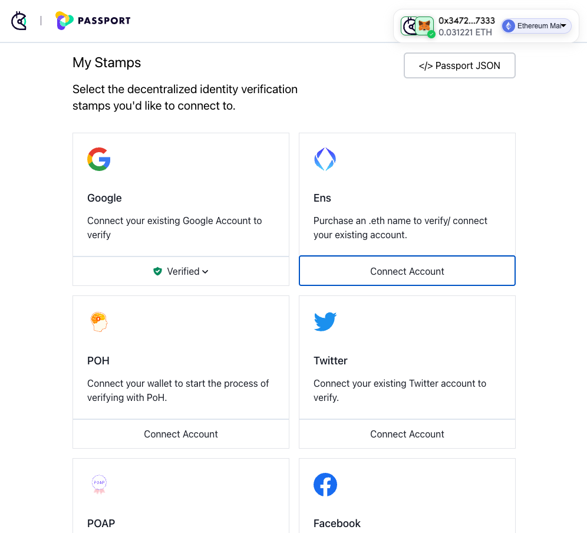
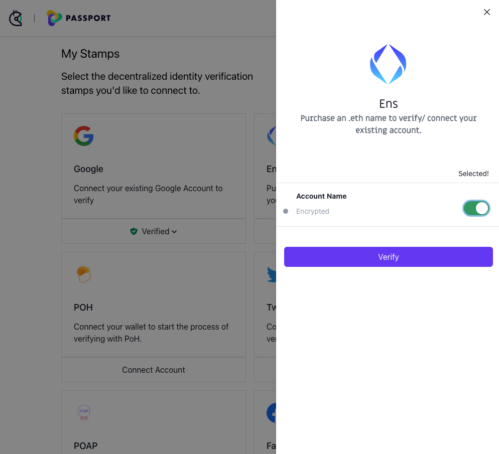
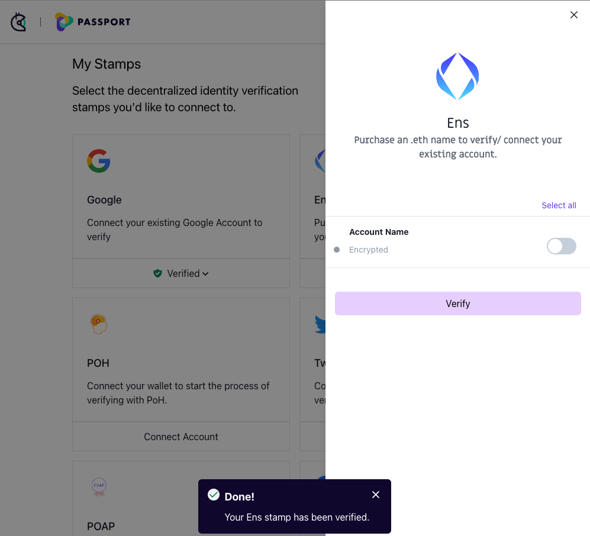

# 🔌 Connecting an ENS account to Passport

This guide gives instructions on connecting an ENS account to Gitcoin Passport and outlines any known issues.

### Prerequisites

* Gitcoin Passport
  * If you don't already have a Passport setup, you can follow our guide to do that first.
* An ENS address held on the wallet address associated with your Gitcoin Passport
  * If you do not have an ENS account, you [can buy one directly from the ENS app](https://app.ens.domains/).

### How to verify your ENS account

Step 1: [Go to passport.gitcoin.co](https://passport.gitcoin.co/) and connect your wallet.

Step 2: Click **Connect Account** on the ENS stamp card.

<figure><figcaption></figcaption></figure>

Step 3: Select the toggles you want to use for your stamp then click **Verify.**

<figure><figcaption></figcaption></figure>

Step 4: A signature request modal will pop up. Read it carefully and then click **Sign**.

<figure><figcaption></figcaption></figure>

Step 5: Return to the passport browser window and confirm your account is now verified.

<figure><figcaption></figcaption></figure>

You can confirm this by seeing the button that previously read as Connect Account will now say **Verified**. Alternatively, you can inspect the Passport JSON.

### Still not working?

If you're unable to connect after following these steps, you can [message Gitcoin support on Gitcoin's Discord](https://discord.gg/b5PEjyVFXT), and we'll try to help resolve your issue.
