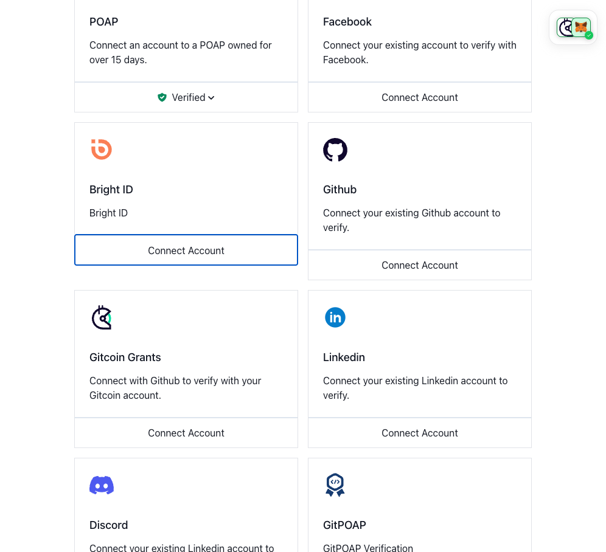
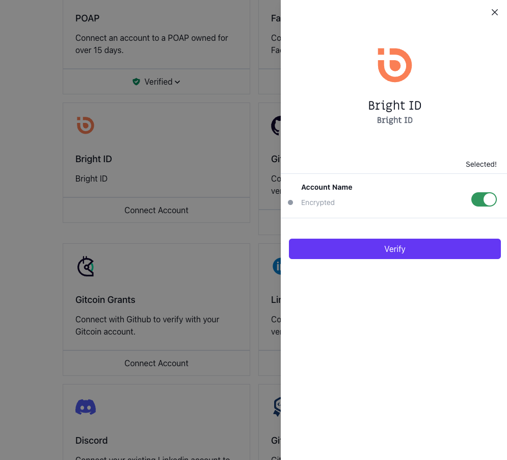
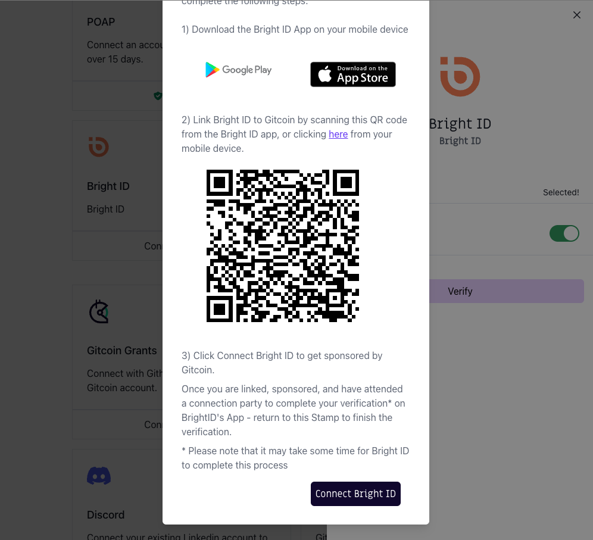
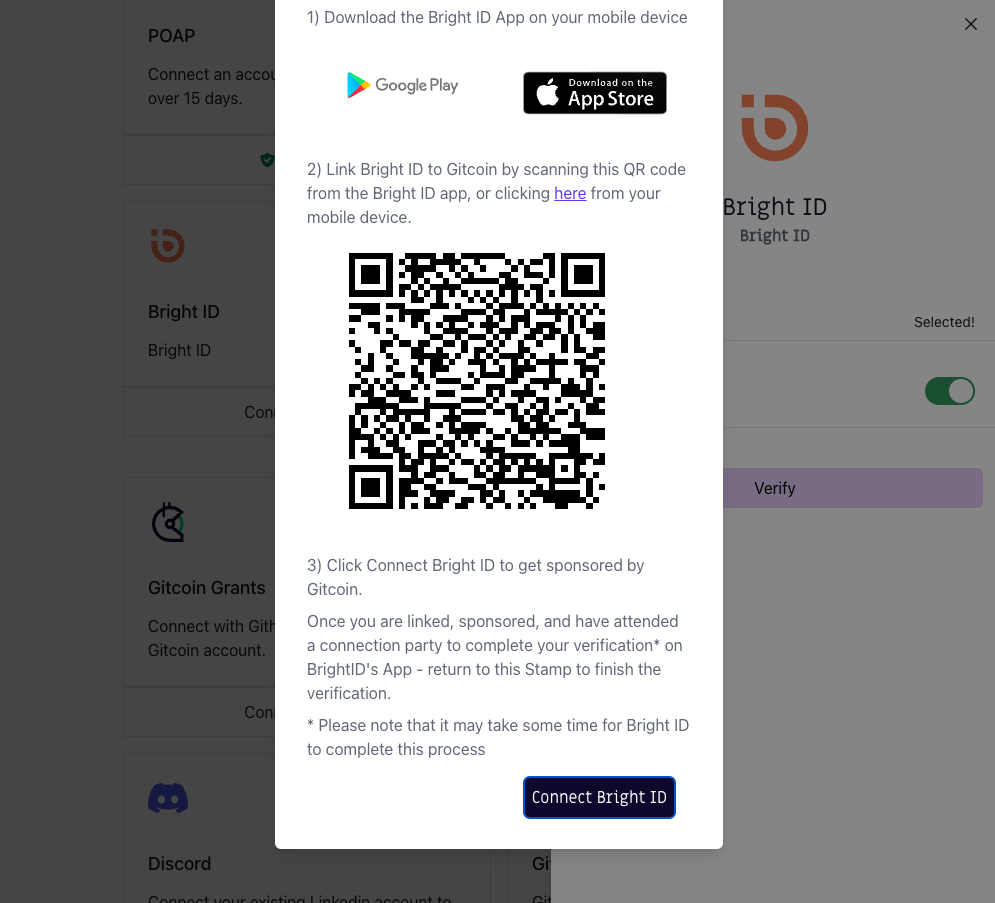

# 🔌 Connecting BrightID to Passport

This guide gives instructions on connecting a BrightID account to Gitcoin Passport and outlines any known issues.

### Prerequisites

* You'll need a BrightID account
  * If you don't already have an account, visit [brightid.org](https://www.brightid.org/) to create one.
* The BrightID app on your phone

### How to verify your BrightID

Step 1: [Go to passport.gitcoin.co](https://passport.gitcoin.co/) and connect your wallet.

Step 2: Click **Connect Account** on the BrightID stamp card.

<figure><figcaption></figcaption></figure>

Step 3: Select the toggles you want to use for your stamp then click **Verify.**

<figure><figcaption></figcaption></figure>

Step 4: A QR code will be shown in a modal. **Scan it from your BrightID app** on your phone.&#x20;

<figure><figcaption></figcaption></figure>

Step 5: The BrightID app will prompt you to link your Gitcoin to BrightID. Click **Yes.**

<figure><figcaption></figcaption></figure>

Step 6: **Wait for success confirmation.** Do not continue before you receive confirmation of successful linking or it will fail and could cause future issues linking BrightID. Do not close the BrightID app during this time.

<figure><figcaption></figcaption></figure>

Step 7: Return to the Passport browser window and click **Connect Bright ID**.

<figure><figcaption></figcaption></figure>

Step 8: Confirm your account is now verified.

<figure><figcaption></figcaption></figure>

You can confirm this by seeing the button that previously read as Connect Account will now say **Verified**. Alternatively, [you can inspect the Passport JSON.](../common-questions/how-to-access-your-passport-json.md)

### Still not working?

If you're unable to connect after following these steps, you can [message Gitcoin support on Gitcoin's Discord](https://discord.gg/b5PEjyVFXT), and we'll try to help resolve your issue.
