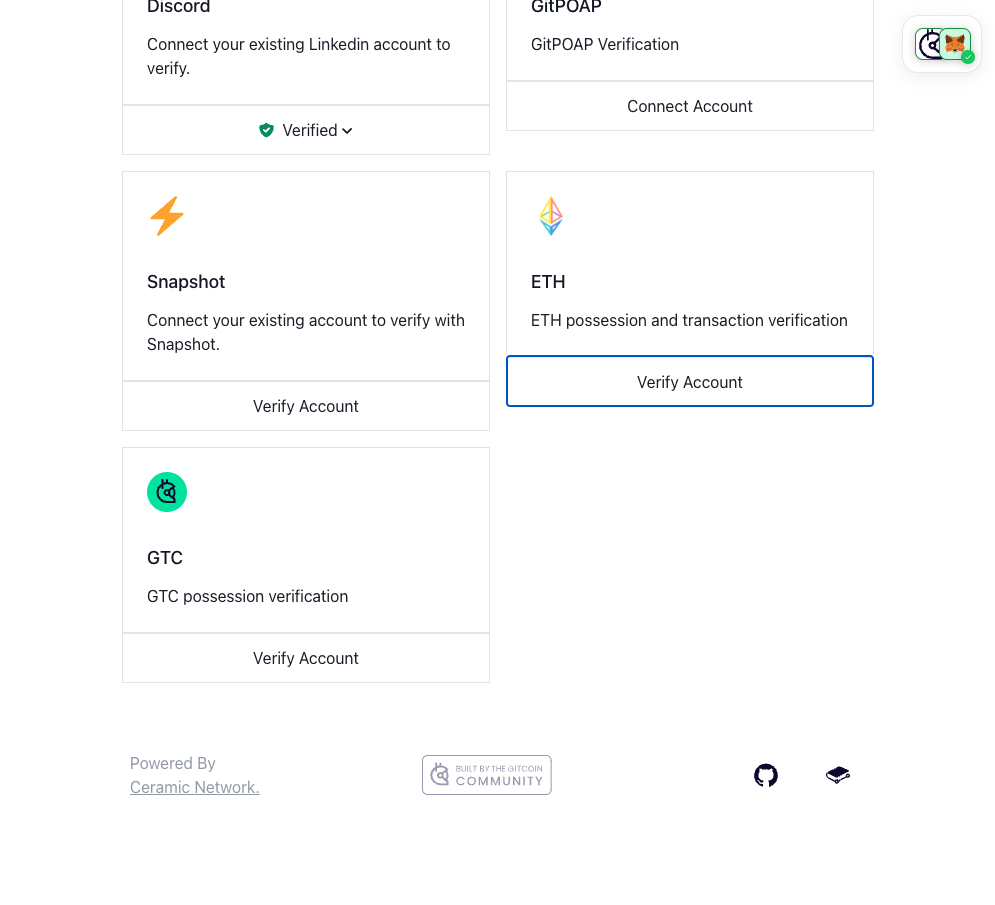
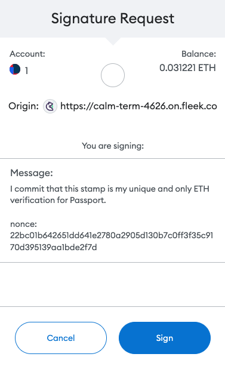
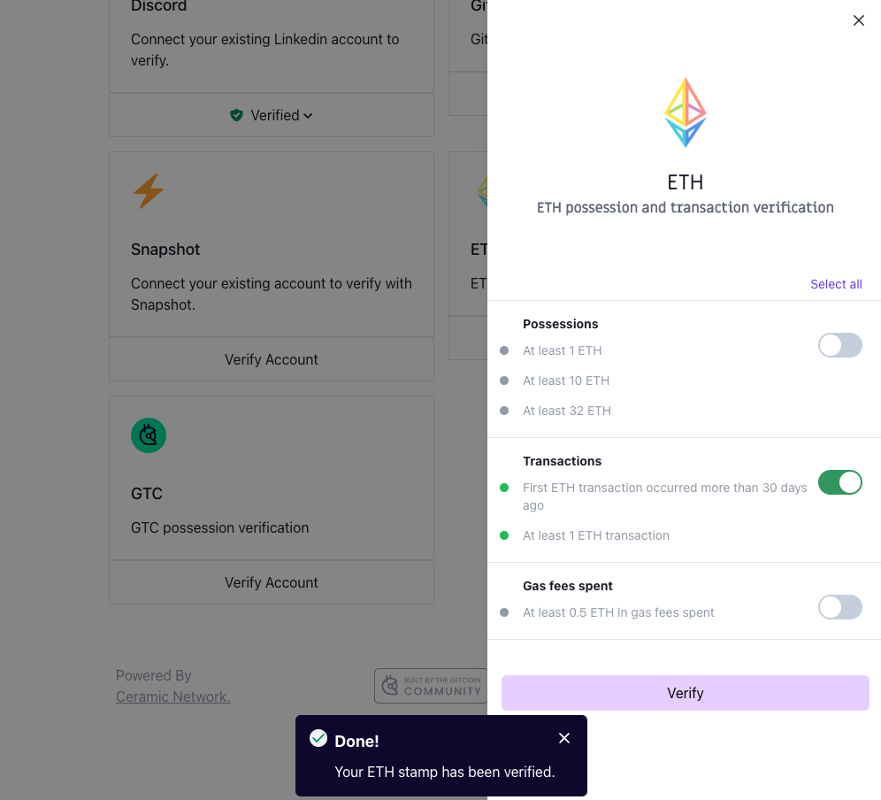

# 🔌 Verifying Ethereum transactions to Passport

This guide gives instructions on verifying Ethereum transactions to Gitcoin Passport and outlines any known issues.

### Prerequisites

* An Ethereum address that has transacted on Ethereum Mainnet

### How to verify your ETH

Step 1: [Go to passport.gitcoin.co](https://passport.gitcoin.co/) and connect your wallet.

Step 2: Click **Verify Account** on the ETH stamp card.

<figure><figcaption></figcaption></figure>

Step 3: Select the toggles you want to use for your stamp then click **Verify.**

<figure><figcaption></figcaption></figure>

Step 4: A signature request modal will pop up. Read it carefully and then click **Sign**.

<figure><figcaption></figcaption></figure>

Step 5: Return to the passport browser window and confirm your account is now verified.

<figure><figcaption></figcaption></figure>

You can confirm this by seeing the button that previously read as Verify Account will now say **Verified**. Alternatively, [you can inspect the Passport JSON.](../commonly-asked-passport-questions/how-to-access-your-passport-json.md)

### Still not working?

If you're unable to connect after following these steps, you can [message Gitcoin support on Gitcoin's Discord](https://discord.gg/b5PEjyVFXT), and we'll try to help resolve your issue.
