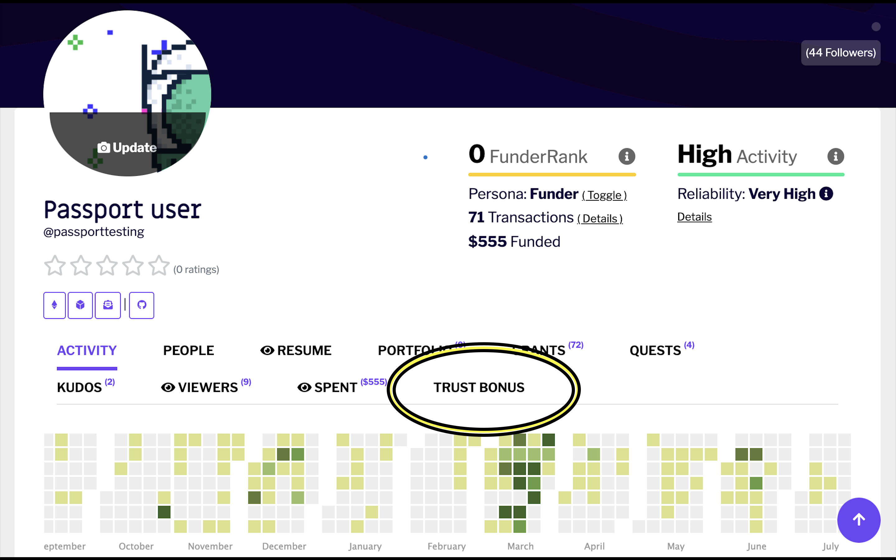
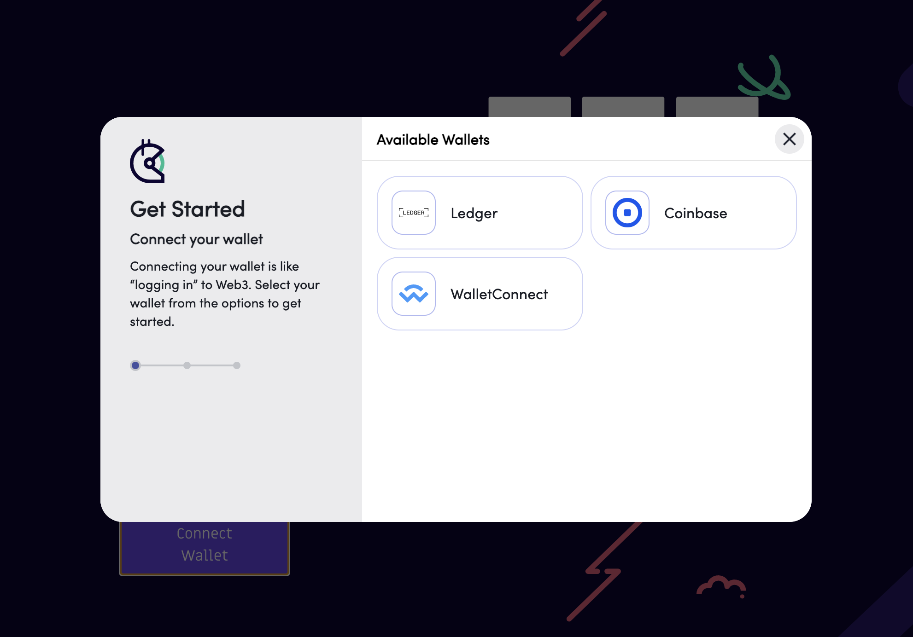

# How do I create a Gitcoin Passport?

### Prerequisites&#x20;

* You should already have a Gitcoin Account

### How to create a Gitcoin Passport

Step 1: Navigate to your Gitcoin profile page. Click the **Trust Bonus** tab

<figure><figcaption></figcaption></figure>

Step 2: Click Create Passport to visit [passport.gitcoin.co](http://passport.gitcoin.co)

Step 3: Click on **Connect Wallet**

<figure><figcaption></figcaption></figure>

Step 4: You’ll see a number of available wallets. Pick the one that best suits you.

<figure><figcaption></figcaption></figure>

Step 5: A signature request modal will pop up. Read it carefully and then click **Sign**.

You’ll find yourself on the “My Stamps” page. You have successfully created a Gitcoin Passport 🎉! [Now it’s time to add Stamps.](how-do-i-add-passport-stamps/)

### Related topics


[how-do-i-add-passport-stamps](how-do-i-add-passport-stamps/)

