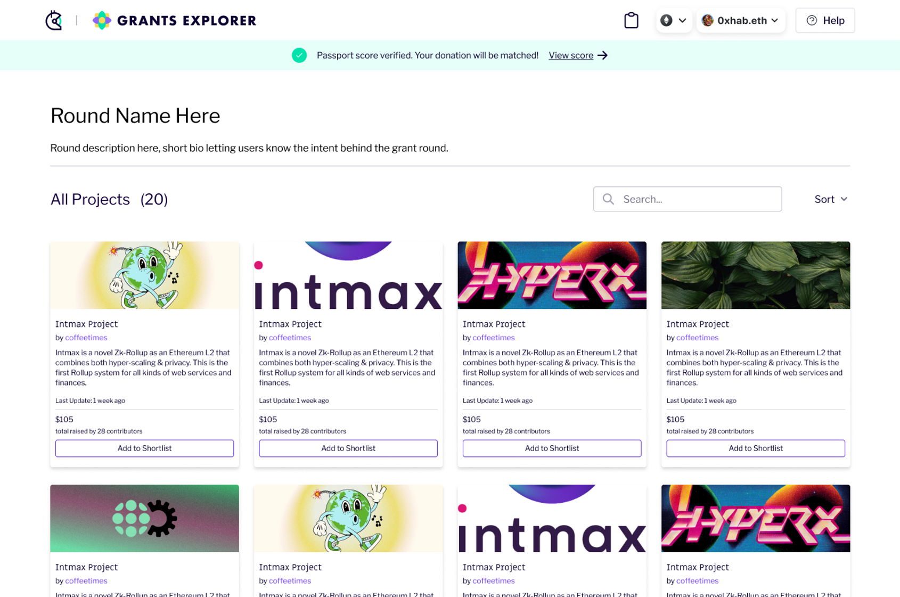
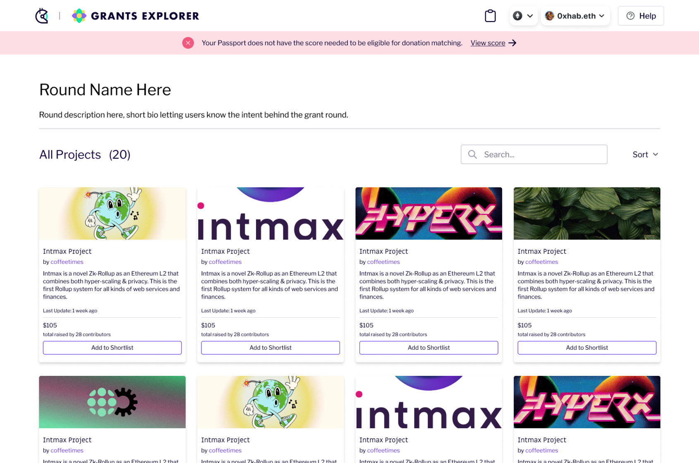
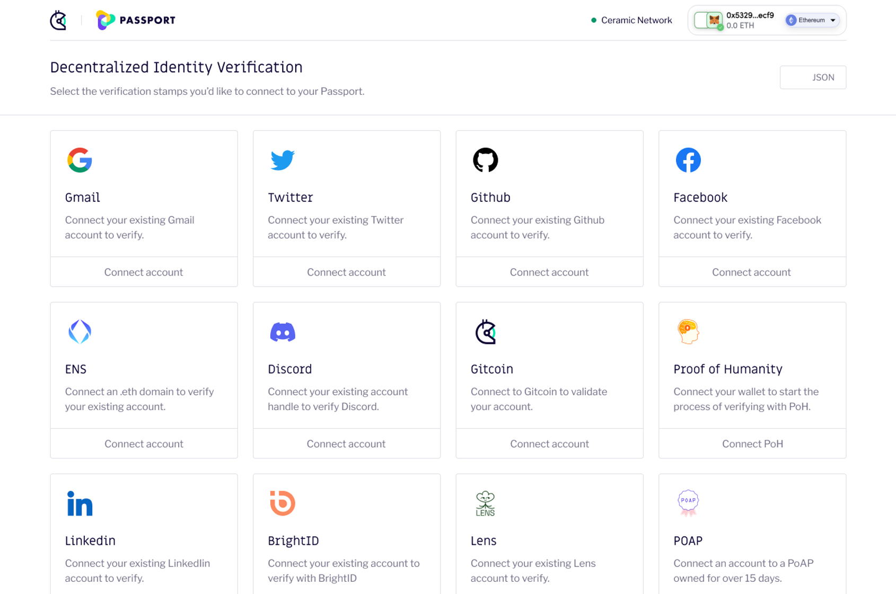

# Grants Explorer 🤝 Passport Guide

## TL;DR

Passport verification allows you to verify your identity as a good actor (and not sybil attackers), and to qualify for your donations to be matched.

## General Overview

### Landing page

When you first arrive on the Grants Explorer landing page, you will see a purple banner indicating you to connect their wallet (_top righthand corner_):

<figure><figcaption></figcaption></figure>

Once you have connected your wallet, you will see either one of two screens. A green banner at the top, or a red banner:

#### Green banner

You will see a green banner if you have a Passport and have a high enough score - _you will be eligible for donation matching_. This means that you have verified your identity by connecting to enough stamps to have a Passport score that meets or surpasses the scoring threshold. You can now continue browsing and donating - no further steps are required. You can always view your score if you wish to do so by clicking on the prompt in the green banner you'll see at the top of the screen.

<figure><figcaption></figcaption></figure>

#### Red banner

You will see a red banner if you don’t have a Passport yet, or if you do have a Passport but your score is too low. You will then have the option to create a Passport and/or view your score and increase it.

<figure><figcaption></figcaption></figure>

### Passport scoring page

You can access this page when you click on “view my score” in the top banner.

If you do not have a Passport yet, you will see this page. Here, you will have step-by-step instructions on how to create a Passport and verify your identity by connecting to various stamps. You will also have access to an article that will dive deep into what Passport is, its value, and how it works.

<figure><figcaption></figcaption></figure>

When you click on the “Create a Passport” button, a new window will open and you will be able to create a Passport and verify your identity by connecting to stamps. This is what that window will look like:

<figure><figcaption></figcaption></figure>

Once you have, ideally, connected to as many stamps as you can, you can close this window and return to the passport scoring window. Then, as per the step-by-step directions, you must update your score. You can do so by clicking on the “Update score” button.

### Ineligible scores

A score will be ineligible if you do not have a Passport or if your Passport score is too low. You will see a screen like this:

<figure><figcaption></figcaption></figure>

If you wish to raise your score, you must open your Passport and verify it with as many stamps as you can. Once you have verified more stamps, then you should have an eligible score. If not, then there is not much more you can do. _You will still be able to donate, but your donations will not be matched._

### Eligible scores

After you have connected to your Passport, verified enough stamps, and updated your score, your score will be eligible for donation matching. You will see a screen like this:

<figure><figcaption></figcaption></figure>

After reaching an eligible score, no further action is needed. You can go back to browsing and know that your donations will be matched.
