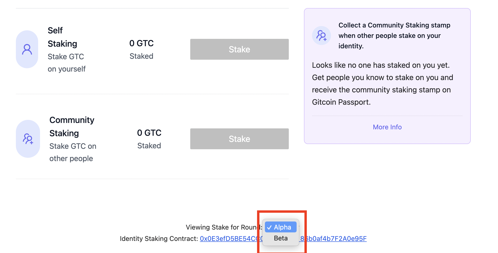

# GTC Staking FAQ

### Why is my staking Locked?

In order to prevent users from sybil attacking through staking their GTC and moving it across multiple passports during a Grants Round, all GTC staked is locked through the duration of the current Grants Round.

### When can I withdraw my GTC?

You can withdraw your staked GTC when any particular grants round is over.

### 'I locked some GTC, where can I find it'?

<figure><figcaption></figcaption></figure>
