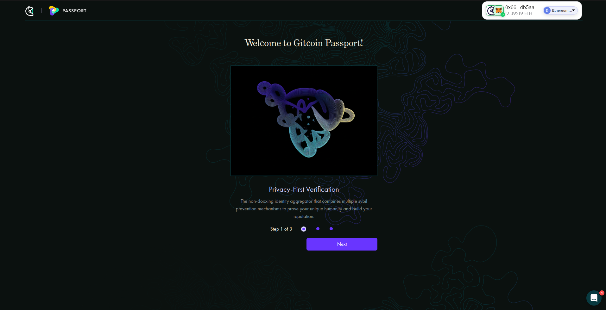
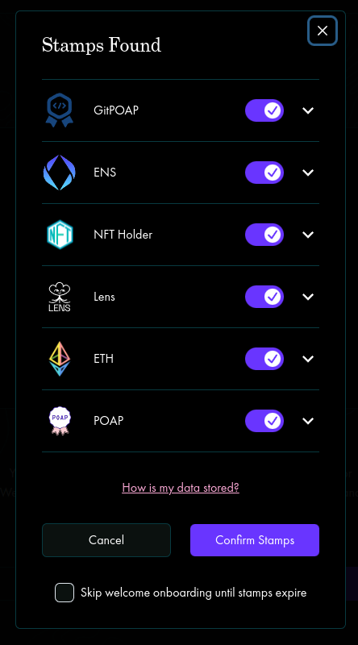
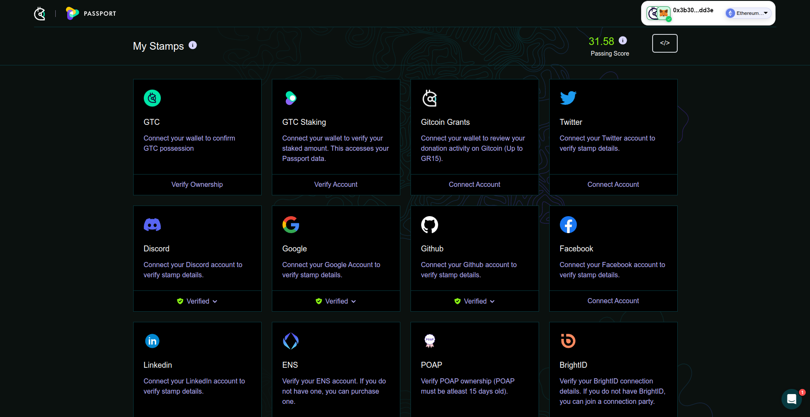
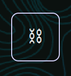

# Moving your Stamps onchain

Gitcoin Passport Stamps are verified offchain using Gitcoin's server. However, they can be minted onchain.&#x20;

Minting your Passport onchain creates a tamper-proof record of your Gitcoin Passport onchain. This is only required if you're using applications that fetch Gitcoin Passport data onchain.

The benefits of doing this are:

* Apps that use smart contracts can easily retrieve your Passport Stamps and score
* You are no longer reliant upon Gitcoin's servers to provide your Passport credentials - they are available forever on the blockchain
* Your Stamps are permanently stored on the blockchain - each app gets to choose what age of Stamp they consider to be valid

## Cost

There is a one-off fee of $2 for doing this and you'll have to pay gas on the chain that you are using. While it is possible to migrate your Stamps to Ethereum Mainnet, this is also the most expensive option with respect to gas fees. Therefore, it is recommended to use a Layer 2 (for example, Optimism) where possible.

## Instructions

First, you will need a Passport with Stamps. If you need to create a Passport or add Stamps, please visit the Creating your Gitcoin Passport and Collecting Stamps pages.

With your Passport ready, visit [passport.gitcoin.co](https://review.passport.gitcoin.co).

You will be greeted with the option to sign in with Ethereum. Click the `Sign in` button.

<figure><figcaption>
Passport homepage
</figcaption></figure>

Once you are signed in, you will be greeted by some information cards that you can read and click through to learn about some foundational concepts of Gitcoin Passport.

<figure><figcaption>
The Passport app after signing in
</figcaption></figure>

The third card describes the one-click option for web3 Stamps. Choosing this option will trigger a pop-up showing the web3 Stamps in your Passport. These are Stamps that can be verified by querying the blockchain, rather than relying on authorization tokens from an offchain service.&#x20;

<figure><figcaption>
The web3 Stamp pop-up
</figcaption></figure>

Clicking `Confirm Stamps` checks that all your web3 Stamps are still valid.

You may also want to refresh your non-web3 Stamps too. You can do this on the next screen by clicking each Stamp.

<figure><figcaption>
The Stamp screen where you can verify each Stamp in your Passport
</figcaption></figure>

Now you are ready to migrate your Stamps onchain! In the upper right of the app, you will see a button with a chain symbol. It looks like this:

<figure><figcaption>
The button to mint Stamps onchain
</figcaption></figure>

Clicking this button will start the Stamp migration. You need to make sure you are connected to the chain you want to migrate onto. The chain can be selected in a dropdown menu to the right of your Ethereum address in the upper right of the app.

Your wallet will pop up a request to sign a transaction. This will incur a gas fee and Gitcoin fee ($2) so you will need to have a sufficient amount of your chosen chain's gas token to complete the transaction.

Once you sign, the transaction will execute and your Stamps will be available onchain.

A success pop-up will appear offering you the option to check your Stamps. Clicking this will redirect you to the Ethereum Attestation Service explorer, where you will see an attestation for each of your verified Stamps. This confirms that your Stamps exist on the blockchain!

## How do Stamps get onchain?

Stamps are not initially verified onchain. Instead, Gitcoin's server verifies Stamp credentials and stores the data on Ceramic. These act as "ground truth" from which onchain Stamps are created. The way they move onchain is through the[ Ethereum Attestation Service](https://attest.sh/).&#x20;

The flow is as follows:

1. Users click a "mint onchain" button in the Gitcoin Passport app
2. The server checks that all the user's Stamps are still valid, and then creates a list of attestation requests (one for each Stamp), a signature, and a unique counter (known as a `nonce`) that prevents each Stamp from being minted multiple times.
3. The attestation requests are passed to a smart contract that checks the signature to ensure it came from a trusted server (currently the only trusted server is the same one that mints the Stamps, in other words, Gitcoin's `IAM` server).
4. The attestation requests are passed to a smart contract, `GitcoinVerifier`, which checks the attestations are coming from a trusted source (in other words a Gitcoin address) and then passes the validated requests to a second smart contract, `GitcoinAttester`.
5. The `GitcoinAttester` contract writes the attestation data to the Ethereum Attestation Service.
6. Other smart contracts, or offchain apps, can now query the data by calling functions in the `GitcoinAttester` contract.

\
